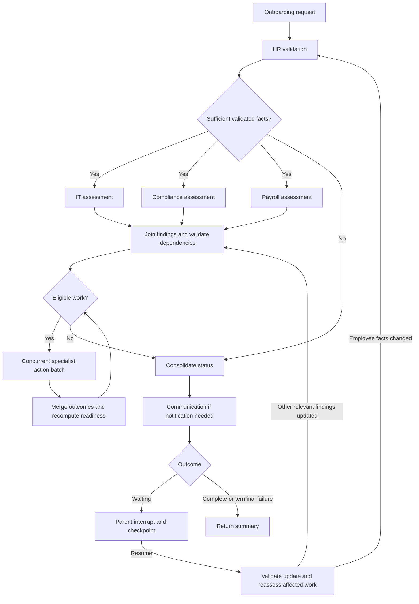

# ADR-0007: Onboarding orchestration and concurrency

- Status: Accepted
- Date: 2026-09-22
- Basis: User approval of the main graph and concurrency proposal

## Context

The five specialist boundaries are established in ADR-0002 through ADR-0006.
Independent work should run concurrently, while discovered prerequisites must be
enforced before external actions. Missing information in one area must not prevent
unrelated eligible work from proceeding.

## Decision

Use one main LangGraph coordinating five specialist subgraphs. The parent uses
deterministic routing and eligibility checks; specialist agents supply reasoning.
An additional LLM supervisor is not required initially. Prefer native graph
branching, synchronization, and state-update mechanisms over custom scheduling
infrastructure. Execute model, tool, and database I/O asynchronously.

### Assessment and action

HR first establishes sufficient validated employee facts. IT, Compliance, and
Payroll then assess requirements concurrently. Separate assessment from action
within these specialists: assessment returns structured proposals; action executes
only work that has passed dependency validation. These are phases of the same
specialist, not additional agents.

The initial assessment has a synchronization barrier. Merge findings and validate
cross-agent dependencies before dispatching writes. An unavailable assessment is
not evidence that there are no requirements; affected actions remain ineligible.

Dispatch eligible independent actions in bounded concurrent batches. Merge their
outcomes, recompute readiness, and repeat while additional work is runnable. The
graph structure stays stable while requirements and eligible work change.

The diagram is conceptual. Reassessment after resume includes the relevant
specialist validation, not simply copying supplied claims into readiness state.

### Concurrency boundaries

- Independent lookups may overlap when neither needs the other's result.
- IT, Compliance, and Payroll assessments run concurrently after HR validation.
- Independent eligible actions, such as laptop requests, compliance-case creation,
  and payroll setup, may run concurrently.
- Prerequisite verification precedes dependent actions such as AWS provisioning.
- Consolidation and notification preparation follow the current work batch.
- Competing executions/resumptions of the same onboarding are serialized.

Initially bound specialist concurrency to the three assessment/action branches.
Multiple processes, workers, and durable queues remain deferred under ADR-0001.
Async overlaps I/O; it does not remove dependencies or ensure state safety.

### State-update ownership

Specialists receive relevant snapshots and return separate structured results,
such as IT, Compliance, and Payroll results. The parent merges and validates these
results. Concurrent branches must not overwrite a shared overall status or mutate
each other's task collections.

Subgraphs may retain internal messages in their own state and expose structured
results through wrapper nodes. Exact schemas, reducers, checkpoint namespaces,
and persistence ownership remain subjects for the state-design discussion.

### Waiting and resumption

Specialists return missing-input or resolution needs as business outcomes rather
than immediately interrupting the parent. The parent collects results, exhausts
independent runnable work, consolidates status, and requests Communication when
needed. It then interrupts when external input or completion is required.

Resume validates the update and reassesses affected work. Bank-detail submission,
for example, requires Payroll validation before setup becomes eligible. Changed
employee facts route through HR and invalidate affected downstream findings as
appropriate; precise invalidation mechanics remain a state-design decision.

Keep sends and other side effects outside the waiting node because interrupted
nodes restart from their beginning when resumed. All writes still require shared
idempotency handling. Business completion and delivery outcomes stay distinct as
specified in ADR-0006.

### Failure and progress handling

Expected operational failures become explicit specialist results so successful
sibling work is preserved and unrelated eligible actions can continue. These
include exhausted transient retries, unavailable evidence, and uncertain writes.
Do not disguise unexpected programming errors as ordinary business blockers;
retain errors and their traces.

Bound tool duration, retries, and graph steps. Detect no-progress iterations and
report why execution cannot advance rather than looping. Detailed limits and
reconciliation mechanics will be decided separately.

## Consequences

The parent remains inspectable, specialists keep business ownership, and parallel
I/O reduces unnecessary serial waiting. The initial barrier intentionally trades
some latency for clear dependency validation. Slow branches delay their batch, so
timeouts must bound execution.

Tests should verify that independent operations can overlap, prerequisites hold at
submission, blocked areas do not suppress independent work, results merge without
loss, and resume reassesses affected requirements. Exact scheduling order is not a
correctness requirement when multiple orders are valid.

This records orchestration only. It does not finalize database schemas, state
recovery details, model selection, tool signatures, or observability configuration.
